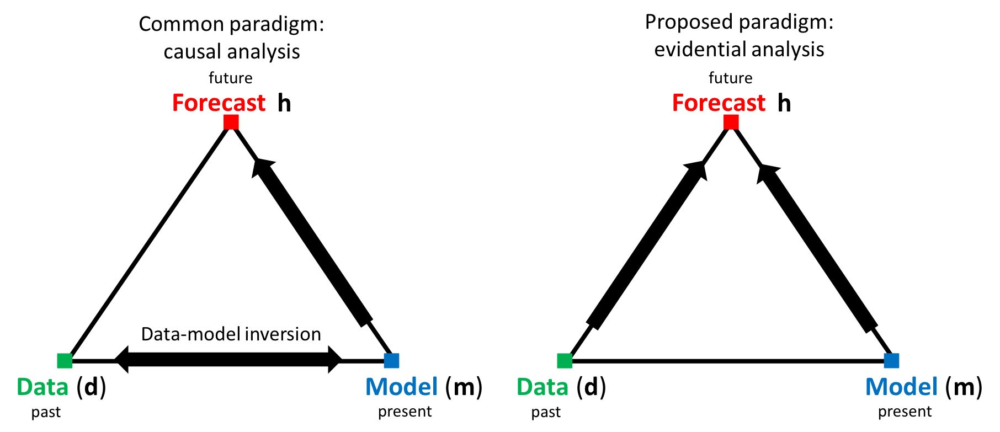

Prediction Focused Analysis: Forcasting Reservoir Performance Using Production Data Without History Matching
======================

# Overview

The conventional paradigm for predicting future reservoir performance from existing production data involves the construction of reservoir models that match the historical data through iterative history matching (left triangle). We propose an alternative re-formulation of the problem, in which the role of the reservoir model is reconsidered. Instead of using the model to match the historical production, and then forecasting, the model is used in combination with Monte Carlo sampling to establish a statistical relationship between the historical and forecast variables. The estimated relationship is then used in conjunction with the actual production data to produce a statistical forecast. This allows us to quantify posterior uncertainty on the forecast variable without explicit inversion or history matching. We call this approach for direct forecasting Prediction Focused Analysis. In this repository, we show the application of this methodology to a real field case in Libya. 

# Data

The case study is modeled after the WinstersHall Concession C97-I in Libya. 5 Producers and 3 Injectors have been in place for 3500 days, and production data is available for all 5 days. A decision needs to be made regarding drilling a new infill well (PNEW). The workflow consists of two parts a) Constructing the prior models and forward simulating to obtain responses b) Applying canonical functional correlation analysis to estimate the posterior forecast distribution.

# Usage

## Model Generation
TODO: Add in links to files for model generation 

## Canonical Functional Correlation Analysis
A Jupyter Notebook providing a step-by-step walkthrough of PFA using CFCA can be found [here](src/notebooks/PFA-CFCA%20Libyan%20Case.ipynb). 

Alternatively, a demo script is provided [here](src/demo/LibyanCaseDemo.m).

# Third Party Code
The Functonal Data Analysis is courtesy of [Jim Ramsay](http://www.psych.mcgill.ca/misc/fda/software.html "FDA Software").

# Questions? 
Contact <lewisli@stanford.edu>